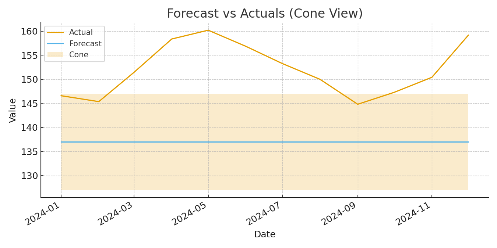

# Forecast Guardrails (MAPE drift alerts)


Lightweight template for rolling backtests, drift alerts, and a cone chart.
Quick start:
```
pip install -r requirements.txt
python demo.py
```
Files:
- src/guardrails.py
- demo.py
- data/sample_timeseries.csv
- assets/forecast_cone.png
- first_comment.txt
